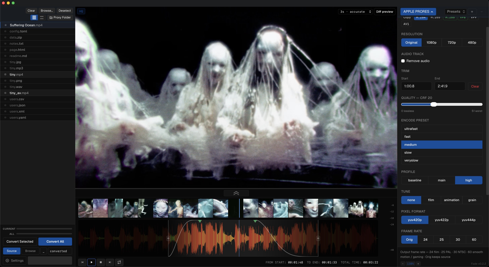

# Fade

**Convert, trim, and process audio, video, and images — on your Mac.**

Drag in a file, pick a format, convert. No cloud, no subscription, no account.



---

## What it does

- **Convert anything** — audio, video, images, 3D models, documents, archives
- **Trim clips** — set in/out points with a visual waveform scrubber
- **Batch queue** — drop multiple files, convert all at once
- **100+ formats** — MP3, FLAC, AIFF, AAC, Opus, Vorbis, WAV, MP4, MOV, MKV, ProRes, HEVC, WebM, JPEG, PNG, TIFF, AVIF, WebP, DNG, and more
- **Output control** — choose destination folder, add a suffix, or overwrite in place

Runs locally. Nothing leaves your machine.

---

## Download

> macOS 13+ · Apple Silicon & Intel

Releases coming soon.

---

## Build from source

```
npm install
npm run tauri build
```

Requires [Rust](https://rustup.rs) and [Node.js](https://nodejs.org).

```
npm run tauri dev   # development
```

---

Part of the [Libre Apps](https://github.com/eldo9000/Libre-Apps) family.
